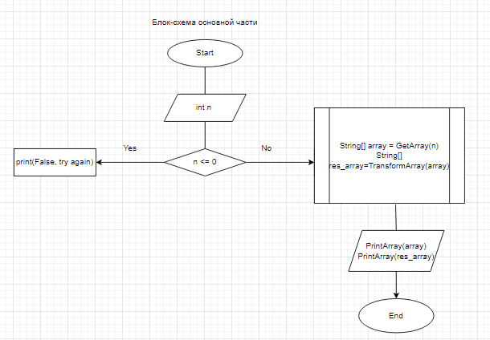
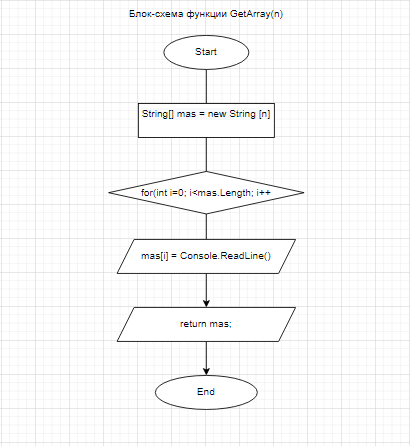
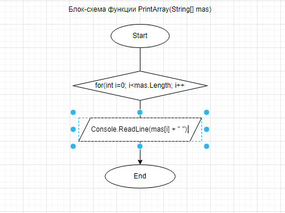
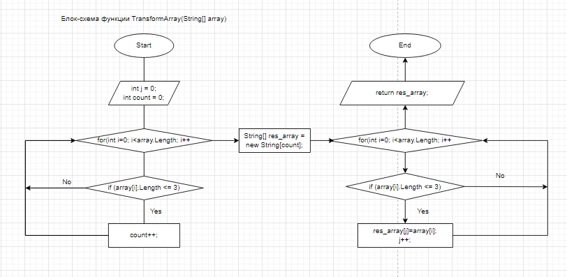

# Описание программного кода для итогового проекта
 ## Задание состоит в написании кода, который из массива строк формирует другой массив с элементами, длина который меньше или равна 3.
 *** 
  В основном блоке кода, мы задаём размерность исходного массива, который должен быть больше 0 и будем обращаться к функциям для решения поставленной задачи.
  
  ***
 В програмном коде создано три функции:
 1. **GetArray(int n)**
 - Данная функция отвечает за заполнение исходного массива строк элементами, которые хотив ввести.
 
 ***
 2. **PrintArray(String[] mas)**
 - Эта функция отвечает за вывод массива на экран
 
 ***
 3. **TransformArray(String[] array)**
 - Данная функция находит количество элементов с длиной <=3 в переданном массиве и создает новый массив, состоящих из найденных элементов.
 
 ***